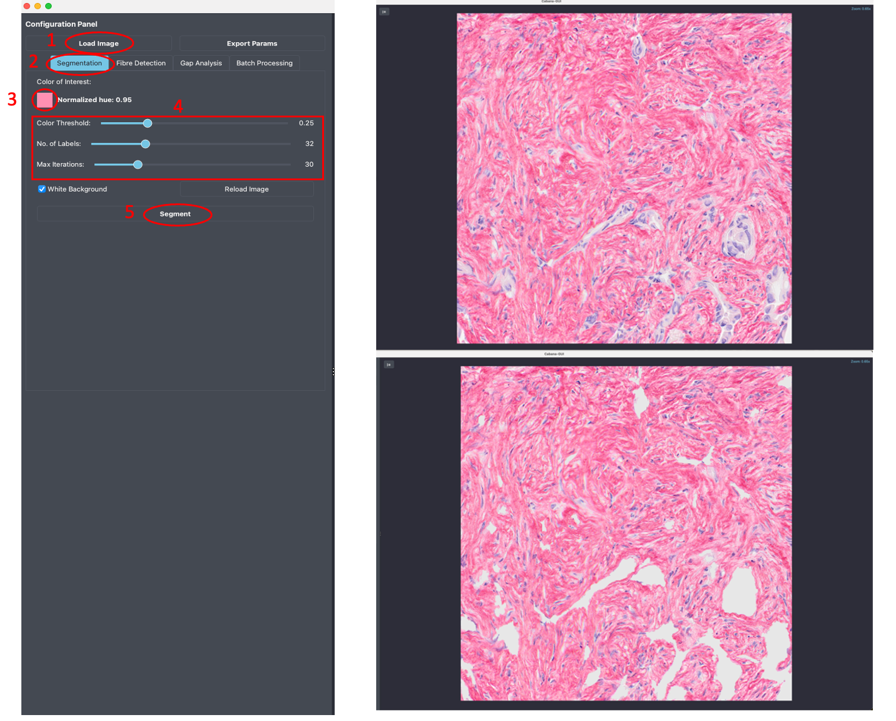
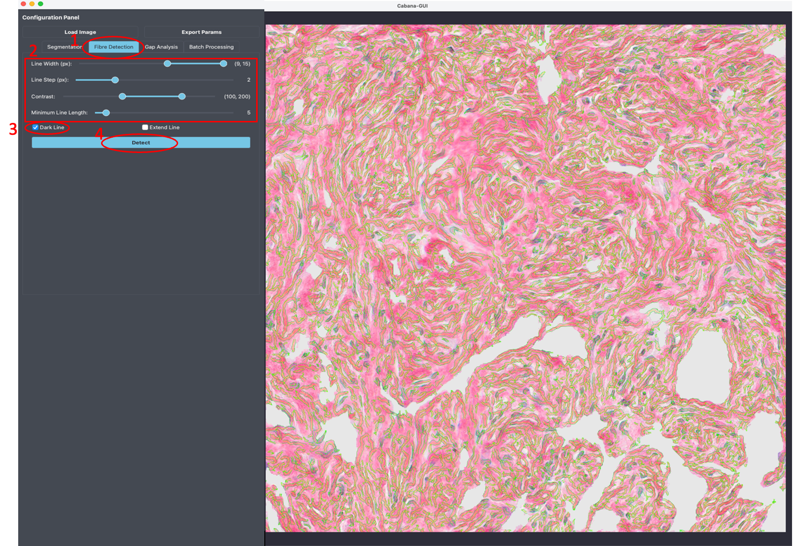
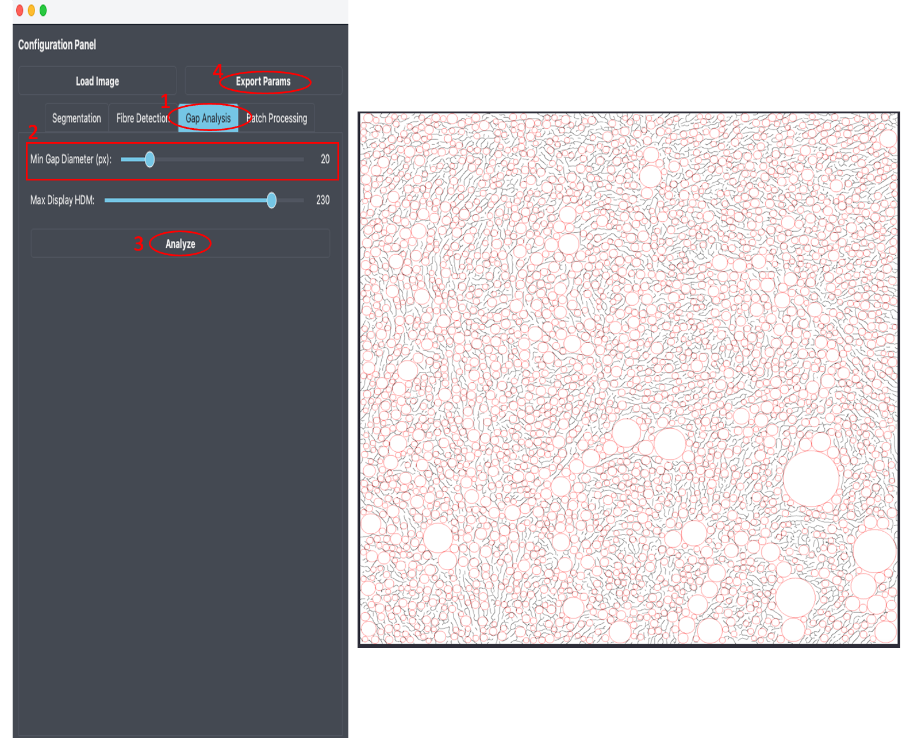
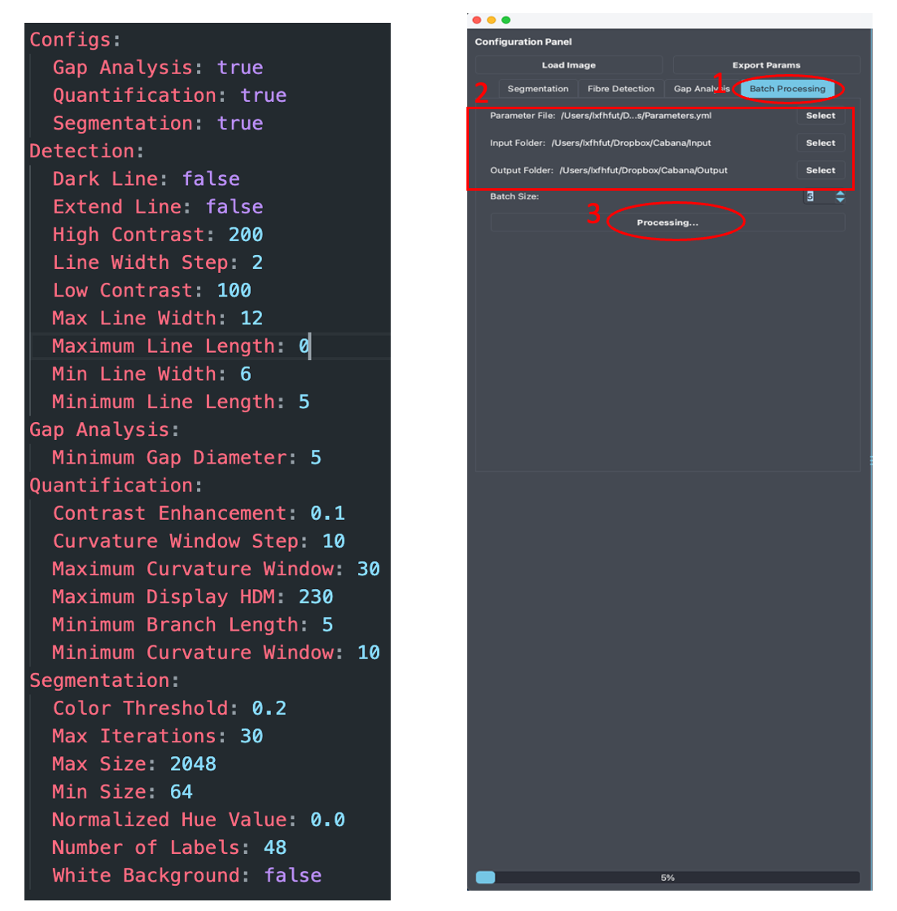
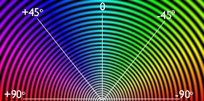

# Image Analysis Workflow

Once the Cabana GUI is launched, you'll see a window split horizontally: the control panel on the left and the image viewing area on the right. The program is designed to let you:

1. experiment with parameters for different components using your data, and
2. export the optimized parameters for batch processing on larger datasets.

To begin, select a representative image from your dataset, then sequentially work through the parameter sections for image segmentation, fiber detection, and gap analysis to determine the optimal settings for your analysis.

## Segmentation

Under the **`Segmentation`** tab, you will find the parameters for adjusting the segmentation:

1. **Colour of Interest**: Specifies the primary colour used for selecting areas of interest in the segmentation. You can choose this colour directly from the image using the colour selector.

2. **Normalised Hue**: Sets the hue value (in the range [0, 1]) in the HSB/HSV colour space corresponding to the selected segmentation colour.

3. **Colour Threshold**: Defines the minimum mean hue value required for a segment to be considered part of the region of interest (ROI).

4. **Number of Labels**: Controls the level of granularity in the segmentation by specifying the number of distinct labels.

5. **Max Number of Iterations**: Sets the maximum number of iterations to run during the segmentation process.

6. **White Background**: Determines whether the non-ROI areas are filled with white. Enabled by default. Disable this option if you're detecting bright fibres on a dark background.

Note: if you want to select a different colour of interest on the image, you can use the button "**Reload Image**" to reload image so that the original image will be shown again on the image viewer.

## Fibre Detection

The '**Detection**' tab defines the fibre detections parameters as described below:

1. **Line Width (px)**: Specifies the minimum and maximum width (in pixels) of lines (ridges) to be detected by the ridge detection algorithm.

2. **Line Step (px)**: Sets the sampling interval for line widths between the defined minimum and maximum values.

3. **Contrast**: Defines the lower and upper grayscale contrast thresholds between fibres (lines) and the background.

4. **Minimum Line Length (px)**: Sets the minimum allowable length (in pixels) for detected fibres. Lines shorter than this value will be ignored.

5. **Dark Line**: Enables detection of dark fibres on a light background (e.g., Picrosirius Red-stained images). Disable this option when detecting light fibres on a dark background (e.g., fluorescent or SHG images).

6. **Extend Line**: Enables fibre detection near junctions. Note that it may result in fibre artefacts and should be used with caution.

## Gap Analysis

The '**Gap Analysis**' tab defines the parameters for gap analysis as described below:

1. **Minimum gap diameter**: the minimum diameter of detected gaps (pixels).

2. **Max Display HDM:** the maximum intensity value of the high-density matrix.

Once all parameters in 'Segmentation', 'Detection' and 'Gap Analysis' have been selected, the user can export the selected parameters to a parameter configuration yml file, say Parameters.yml, which can then be used for batch processing.

## Batch Processing

Under the '**Batch Processing**' tab, the user can specify the parameter file, input folder containing the images to be quantified, and the output folder for storing the results. It is recommended to open the Parameters.yml file to review and adjust the settings as needed---for example, disabling segmentation/gap analysis or adjusting specific parameters (refer to the parameter details in next section). Cabana will process the images in the input folder in batches (default batch size is 5). If an issue causes the program to terminate, the user can resume processing from the last batch after addressing the problem.

## Cabana Outputs

Cabana generates an output folder containing the following subfolders:

i. **Batches**

   Stores the results of each analysis batch. Cabana processes images in batches to allow the use of a check-point in case the analysis run crashes and needs to be restarted (see below under 'errors'). The results of all batches are combined into the folders below. Note: Batches folder can be safely deleted when all images have been processed to save storage space.

ii. **Bins**

   Stores the binary masks resulting from ROI extraction. The ROI regions are highlighted in white while backgrounds are highlighted in black.

iii. **Colors**

   Stores subfolders of each processed image with the images of the following analysis results:

   a. all_gaps: gap analysis of whole tissue
   b. angular_hist: angular distribution of fibre orientations.
   c. color_coherency: orientation coherency/alignment in a local window =2 for OrientationJ plugin) of the original image. The rule of thumb for the filter size is to be about 3 times the standard deviation (sigma value) in each direction, i.e. window size ~6*2=12px.
   d. colour_curve: vector field visualization of orientation, with vector lengths weighted by coherency.
   e. colour_energy: vector field visualization of orientation, with vector lengths weighted by energy, i.e., gradient vector magnitude.
   f. colour_length: detected ridges are colour-coded according to fibre length. Note: this only applies to fibres without branches.
   g. colour_mask: detected ridges and branches
   h. colour_orientation: fibre orientation in [] within a local window
   i. colour_skeleton: detected fibres with branchpoints (yellow) and endpoints (green)
   j. colour_width: detected ridges with calculated fibre widths
   k. gray_width: widths in terms of integer pixel numbers at ridge points/pixels.
   l. intra_gaps: gap analysis of intra-collagen fibre gaps
   m. orient_colour_survey: color coding of orientation in HSB colour space, where hue is orientation, saturation is coherency, brightness is the grayscale of the original image.

   

   n. orient_vf_constant: vector field visualization of orientation with constant/equal weights

iv. **Eligible**

   Stores the images to be analysed after the removal over-sized images. The 'Ignored_images.txt' file inside the subfolder records the names of the over-sized images that have been ignored.

   Note: images that are larger than 2048 x 2048 pixels will automatically be cropped into subregions < 2048 x 2048 px and saved as individual ROIs.

v. **Exports**

   Contains colour-code images of following results:

   a. Coherency: coherency/alignment of orientation in a local neighbourhood
   b. Colour survey: same as above in 3.m
   c. Curve map: curvatures of the detected fibres for selected curvature window sizes
   d. Energy: magnitude of gradient vector 
   e. GapImage: Map of tissue gaps (red) -- based on non-segmented image
   f. GapImage_intra_gaps: Map of intra-fibre gaps (green) -- based on segmentation ROI
   g. Length map: higher intensity values represent longer fibres. The image intensities are stored as unsigned 16-bit integers. Best viewed in ImageJ/FIJI.
   h. Mask: detected fibres and fibre branches
   i. Orientation: orientation angles in radians ranging from to.
   j. Skeleton: shows branchpoints (yellow circles) and endpoints (red circles) of detected fibre spines
   k. Width: ridge detection results with the estimated ridge width

vi. **HDM**

   Stores the high-density matrix areas as defined in Parameters.yml

vii. **Masks**

   Stores the results of ridge detection and of the gap analysis in the 'GapAnalysis' folder. The 'GapAnalysis' folder comprises of two output images for each image. One image features red circles, visualizing the gaps between fibres of the non-segmented image.

   The second image shows green circles depicting gaps within collagen fibre areas (intra-collagen gaps) of the segmented image.

viii. **Fibres**

   Stores the visualization results of ridge detection as an overlay with the original image.

ix. **ROIs**

   Stores the results of the image segmentation.

x. **QuantificationResults.csv**

   Contains all resultant image statistics. Please refer to the section 'List of Cabana read-outs' for a detailed explanation of analysis results.

   'Output' also contains the file version_params.yaml showing all parameters used for the analysis run and the version of Cabana for version tracking and reproducibility purposes.
